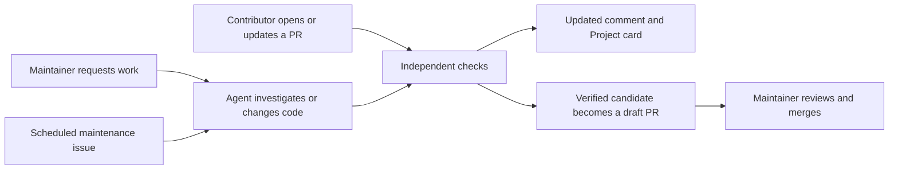

# Darkbloom engineering automation

Work stays in GitHub. Each issue or PR gets one status comment that updates with
the current task, checks, findings, and next step. The
[Project board](https://github.com/orgs/numinous-technology/projects/1/views/2)
shows the same work across threads.



| Start work | What happens |
|---|---|
| Open or update a PR | Check its pinned merge revision and review the diff. |
| Comment `/darkbloom fix <request>` | A collaborator requests a focused change. |
| Comment `/darkbloom review` | A collaborator requests investigation without edits. |
| Comment `/darkbloom retry` | Rerun a review against the current revision. |
| Scheduled maintenance | Review the configured tracking issue and update its existing comment. |

Labels show where work began: `trigger:ci`, `trigger:instructed`, and
`trigger:schedule`. A generated PR keeps its original label when CI runs.
Ordinary conversation does not launch an agent. New revisions invalidate old
verification. Unsupported checks appear as blocked, never passed.

Agent definitions live in `bundles/`. They use the official
[Universal Agent Protocol](https://universalagentprotocol.io/docs/).
Edit instructions through a normal reviewed change. Every run starts from a
fresh checkout; it does not depend on a previous agent's private memory.

To validate configuration and integration tests:

```sh
cd .automation
npm ci --ignore-scripts
npm run validate
python3 -m unittest discover -s tests -v
```

The integration currently runs through GitHub Actions. Brainbase workspace
execution is not connected yet. UAP bundles are portable configuration; moving
execution still requires checking the workspace's credentials, artifact access,
and lifecycle behavior. See `HOW-IT-IS-WIRED.md` for implementation details.
